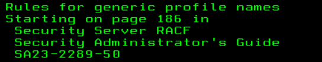

17:18 .Os exercicios começaram a ficar mais dificil e ficar fazendo eles só na
memoria sem anotações estavam ficam cada vez menos viavel.

17:19 . Niveis do RACF Objetos, SubObjetos e Rules

- A terminologia do RACF:

1º PROFILE
     que define 'Objetos' e 'SubObjetos'

2º CLASS
    Nome a coleção de tipos de 'Objetos' ou 'SubObjetos' de Profile < 2 tipo

3º GROUP
    Nome a coleção de coleção de 'SubObjetos' de Profile < 1 tipo

4º ACCESS
    Regras para permit ou deny Usuarios ou Grupos de um Objeto

17:48 . Fundamentos de segurança de dados RACF 

[1680986920022.png](file:///C:/Users/carlinhoshk/dev/Curso-IBMZ-XPLORE/Extended/Anota%C3%A7%C3%B5es/image/nota-08-04-2023/1680986920022.png)

- Um discreto profile protege a single data set que é unica requerimento de segurança
  ( discreto para IBM= '0001IBM' )

